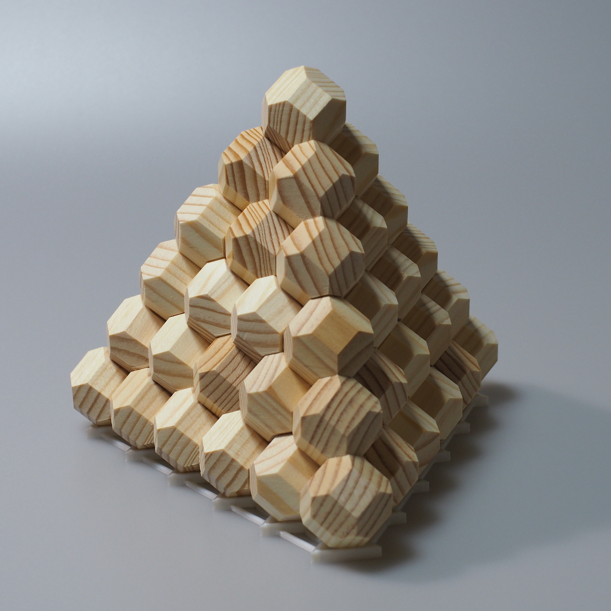

# Tetra-Hex-Metamorphosis
This project is an interactive visualizer for the "Sankakuyama Puzzle", a complex geometric challenge composed of 14 unique pieces. Each piece is formed by four "Chamfered Cubes" connected in various tetra-hex patterns.
This program demonstrates the geometric beauty and the infinite variety of combinations by morphing between three distinct forms: a 2D Hexagonal Grid, a Tetrahedron (Size 6), and a Pyramid (Size 5).

Visit: https://note.com/sankakuyama

Live Demo: https://sankakuyama-puzzle.github.io/Tetra-Hex-Metamorphosis/

🌟 Key Features
Perfect Geometric Alignment: Based on the Face-Centered Cubic (FCC) lattice. The pieces connect precisely at their hexagonal faces, even during transition.
Physical Stacking Logic: Pieces are stacked from the bottom up, following a realistic assembly order. The peak pieces are always placed last.
Rigid Body Metamorphosis: Using matrix interpolation, the pieces maintain their solid wooden feel without distorting during their parabolic flight between bases.
The King's Chamber: Visualization of the internal voids within the Pyramid form, highlighted with a golden wireframe.
Orthographic Beauty: Rendered in orthographic projection to emphasize geometric purity and alignment.

🎮 Controls
[S] Key: Toggle Speed (Normal 0.5s / Slow 1.0s / Super Slow 2.0s)
[P] Key: Pause / Resume animation
[R] Key: Toggle Repeat Mode (Lock current solution / Random shuffle)
Mouse Drag: Rotate view
Mouse Wheel: Zoom in/out

📐 Geometric Insight
All forms in this puzzle are subsets of the same Face-Centered Cubic (FCC) lattice:
2D Hex / Tetrahedron: The grid is aligned with the {111} plane (Vertex-up orientation).
Pyramid: The grid is aligned with the {100} plane, rotated 45° to ensure the hexagonal faces meet perfectly.

The Award-Winning Physical Puzzle: Sankakuyama The digital experience in this repository is a tribute to the physical Sankakuyama Puzzle, a masterfully crafted wooden 3D puzzle from Japan. Good Toy 2024 Award: Sankakuyama was honored with the prestigious Good Toy 2024 award, recognizing its excellence in design, playability, and artistic value. Physical Experience: While this viewer visualizes the mathematical "Metamorphosis," nothing beats the tactile warmth and satisfying "click" of the real wooden pieces forming a tetrahedron. How to Get One: The physical puzzle is available for order at the Tokyo Toy Museum (Museum Shop). It is highly recommended for puzzle enthusiasts and collectors who appreciate fine Japanese craftsmanship.

Technical Stack
Engine: p5.js (JavaScript)
Data: JSON based solution masks (using BigInt for 64-bit coordinate mapping)
Deployment: GitHub Pages

Credits
Original Puzzle Concept & Geometric Logic by Koji Ohashi
Developed with the spirit of geometric exploration.
